# Video Searcher
검색 가능한 비디오 플레이어 Android application

---
#### 프로젝트 사용시 다음 사항을 꼭 적용해주세요!

TimeStampFinder/opencv/cpp/CMakeLists.txt에서, 

- BEFORE
    ```
    set(pathPROJECT E:/2021_SUMMER/TimeStampFinder)
    ```
- AFTER
    ```
    set(pathPROJECT 자신이 프로젝트를 설치한 경로)
    ```
---

### 🏆 한성대학교 제 17회 한성공학경진대회 입상 🏆
✏ 시연영상 : https://www.youtube.com/watch?v=XoeSencsBN8

✏ 소개영상 : https://www.youtube.com/watch?v=Cy15lsRiFMU

| 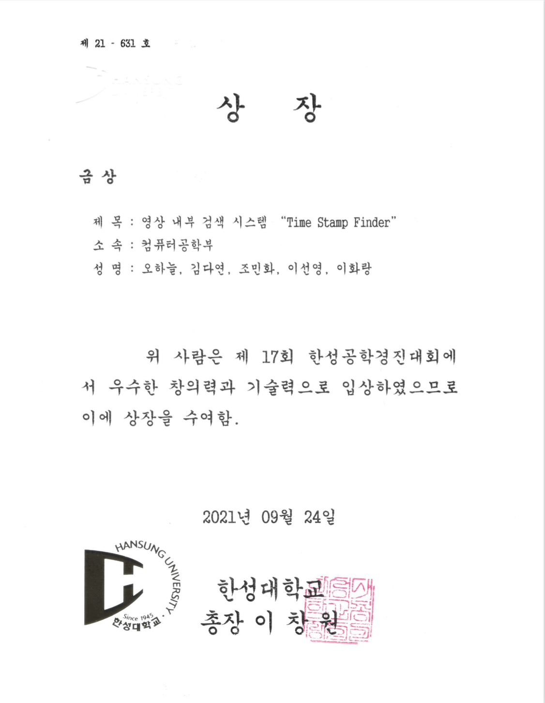 | 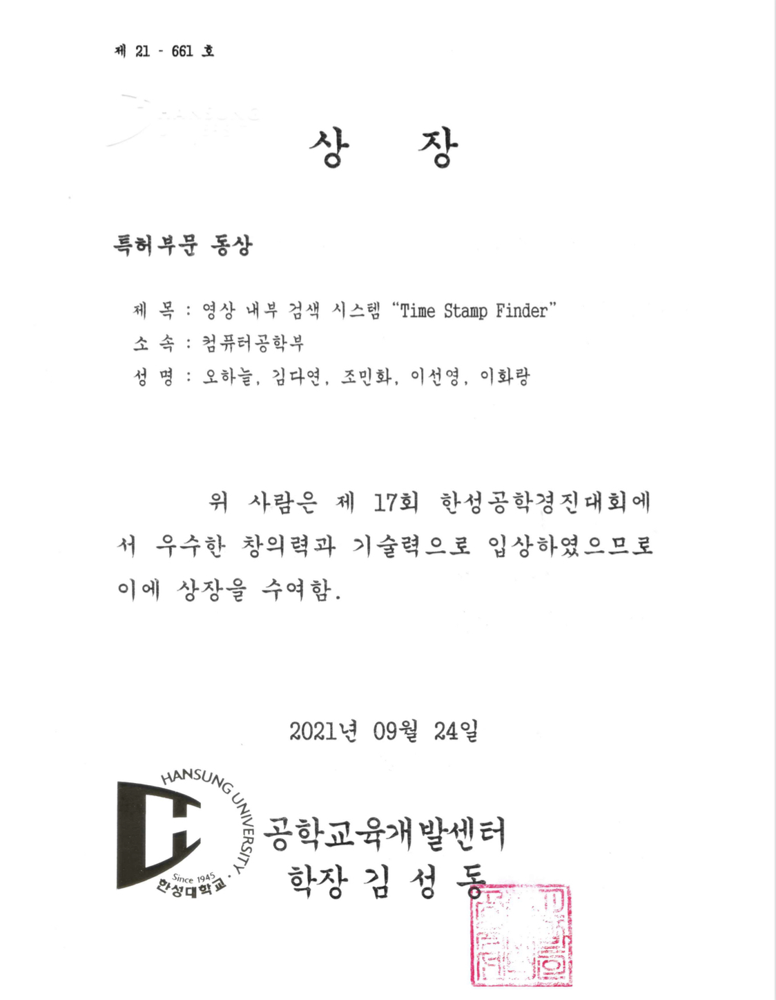 |
| --- | --- |
| 작품부문 금상 | 특허부문 동상 |

---

### 📌 작품 소개


```
💡 저희 골든타임은 영상 내 키워드나 이미지로 검색할 수 있게 하는 시스템을 구현하고,
   이를 통한 소비자의 효율적 영상 시청을 목표로 합니다.
```

1. 프로젝트 정의

      유튜브 등의 영상 플랫폼들로 인해 영상 소비가 이전보다 매우 증가했습니다. 그러나, 영상 속에서 사용자가 원하는 특정 지점을 검색하기는 쉽지 않다. 때문에, 저희 골든타임은 단어와 이미지, 두 가지의 방 법으로 사용자로부터 입력을 받아 해당 지점을 쉽게 재생할 수 있도록 하는 영상 검색 시스템을 설계했습니다.
      사용자로부터 영상 파일을 받으면, 이를 오디오와 비디오 두 가지로 나누어 처리합니다. 먼저, 영 상 파일에서 오디오 파일(.wav)을 추출합니다. 이를 Sound To Text OPEN API를 이용해 텍스트 로 바꿉니다. 이후, 사용자가 키워드 검색 창에서 특정 단어를 입력하면 텍스트와 오디오에서 해당 단어가 나오는 구간을 타임 스탬프 형식으로 제공합니다. 다음으로, 비디오에서는 Open CV를 이용 해 이미지 검색을 지원합니다. 사용자가 키워드 검색 창에서 보고 싶은 물체(예: 꽃, 건물 등⋯)를 입력하면 해당 물체가 나오는 구간을 타임 스탬프 형식으로 제공합니다. 사용자는 타임 스탬프를 클릭해 영상 속 해당 지점으로 쉽게 이동할 수 있습니다.
    
2. 프로젝트 배경
    
      모바일 기기에 친숙한 MZ세대의 콘텐츠 선호도는 글에서 영상으로, 이젠 영상마저 숏폼 (Short-form)이 유행하고 있습니다. 텍스트 콘텐츠의 경우 찾고 싶은 부분이 있다면 Ctrl+F를 통해 간단하게 찾을 수 있습니다. 동영상의 경우 이러한 기능이 없어 따로 타임라인을 적어 두기도 합니다. 이 타임라인은 업로더가 적는 경우도 있지만, 댓글을 통해 사용자가 자발적으로 남기기도 합니다. 이처럼 소비자들은 원하는 정보, 보고 싶은 장면을 바로 찾아보길 원하고 있으며 동영상 콘텐츠에도 Ctrl+F와 같은 검색 기능이 생긴다면 기꺼이 사용할 것입니다.
    
3. 프로젝트 목표
    
      MZ세대의 콘텐츠 선호도 변화에 따라 영상 소비가 늘어나고 있습니다. 기존 글 형식의 콘텐츠는 검 색 창에서 쉽게 검색이 가능하지만, 영상 내에서의 검색은 어려워 영상 소비자가 영상을 효율적으로 시청하는 데에 어려움이 있습니다. 따라서, 본 프로젝트는 영상 내에서 키워드나 이미지로 검색할 수 있게 하는 시스템 구현을 통해 소비자의 영상 효율적 시청을 목표로 합니다.
    

---

### ⚙️ 시스템 구조

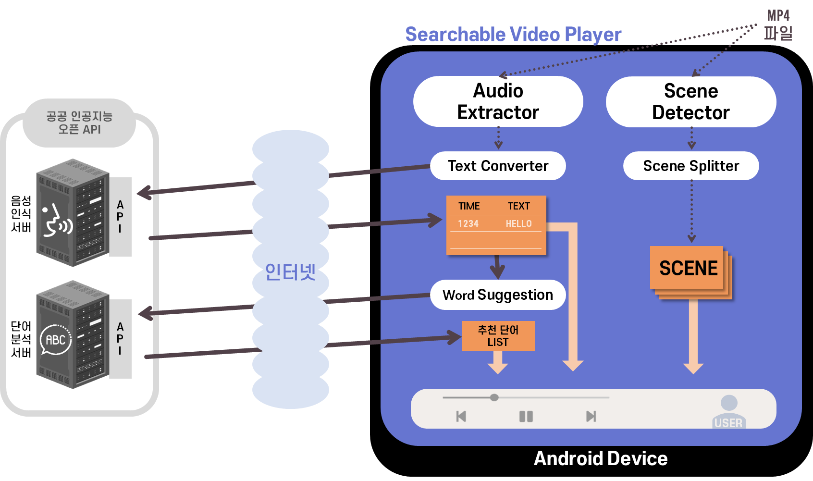

```
💡  Video Searcher는 크게 4가지 부분으로 구성됩니다.

- 영상 속에서 단어를 검색
- 영상 내 주요 키워드 자동 추출
- 영상을 텍스트 파일로 변환하는 기능
- 영상에서의 장면 전환 위치 자동추출
```

1. 영상 속 단어 검색
    
      단어 검색은 사용자가 입력한 단어를 포함한 장면을 찾아 타임라인으로 제공합니다. 비디오 속 음성을 텍스트 파일로 받아 제공합니다. 단어 검색 기능 구현을 위해, 아래 그림⑴과 같은 전처리 단계를 거칩니다.
    
    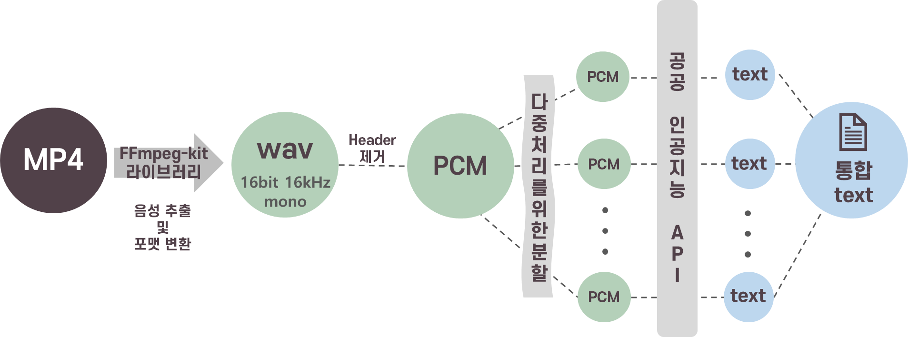
    
      전처리 단계에서는 비디오 파일을 텍스트로 변환하는 작업을 합니다. MP4 파일에 영상과 오디오 데이터 중 오디오 스트림을 추출하기 위해 ffmpef-kit 라이브러리를 활용합니다. 이를 통해 음성인식 API가 인식할 수 있는 WAV mono channel, 16bps, 16kHz sampling rate 형식의 pcm 오디오 데이터로 오디오 스트림을 변환합니다.
    
    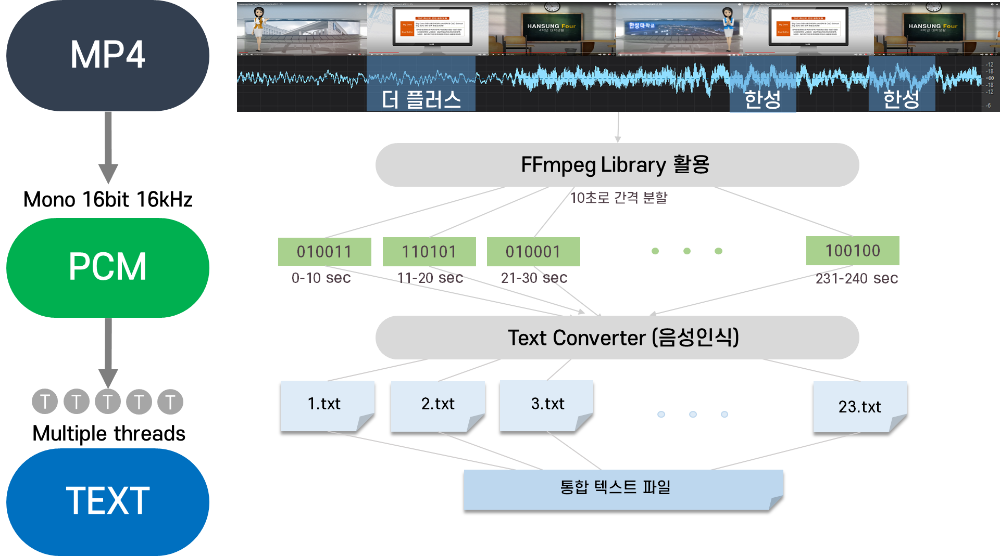
    
      이후 API 처리속도 향상을 위해 pcm 오디오 데이터를 10초 단위로 분할합니다. 분할된 오디오 데이터는 멀티 스레딩을 통해 음성인식 API로 전달됩진다. 음성인식 API는 오디오를 텍스트로 변환한 값을 반환하고, 반환된 텍스트들은 시간과 연관된 인덱스와 함께 하나의 통합 텍스트 파일에 저장되어 추천 단어 제공과 사용자의 검색에 이용됩니다.
      사용자의 검색을 위한 추천 단어 제공을 위해 통합 텍스트 파일을 단어분석 API로 전달합니다. API는 텍스트 파일에서 빈출된 5개의 개체명을 반환하고, 이들을 사용자에게 추천 단어 리스트로 제공합니다. 사용자는 추천 단어 리스트를 통해 빈출된 단어를 확인하거나, 통합 텍스트 파일을 이용해 영상의 내용을 검색할 수 있습니다.
    
2. 영상에서 장면 추출 
    
      장면 추출은 영상 프레임이 급격하게 변하는 시점의 이미지를 추출하여 시간과 함께 썸네일로 제공합니다.
    
    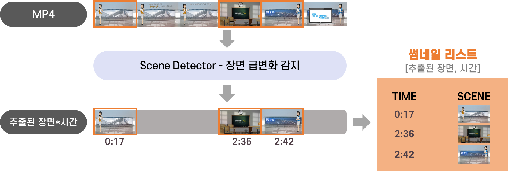
    
      영상에서 프레임을 받아 처리하기 위해 OpenCV 라이브러리를 활용한 C++ 코드를 안드로이드에서 쓸 수 있도록 포팅합니다. OpenCV 라이브러리를 통해 영상에서 이전에 비해 프레임이 급격하게 변화하는 부분을 판단하고 이를 추출합니다. 추출된 프레임을 새로운 장면으로 판단하고 시간과 함께 이미지로 저장합니다.
      OpenCV 라이브러리에서 프레임의 변화를 감지하기 위해서 영상에서의 프레임 A와 B의 차이를 저장한 프레임 P를 만들어 P의 신호 대 잡음비인 PSNR을 구합니다. 이 PSNR의 크기가 기존 설정한 값보다 작으면 장면이 전환되지 않았다고 판단하고, 크다면 장면이 전환되었다고 판단합니다. 장면이 전환되었다고 판단되면, 시각적으로 뒤에 있던 프레임 B를 새로운 장면으로 저장합니다.
    

---

### 🖼 프로젝트 결과

- 시작화면과 영상 파일 선택
    
    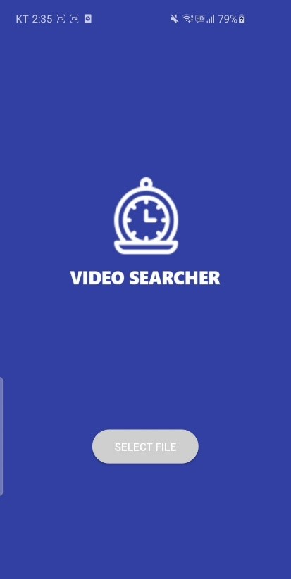 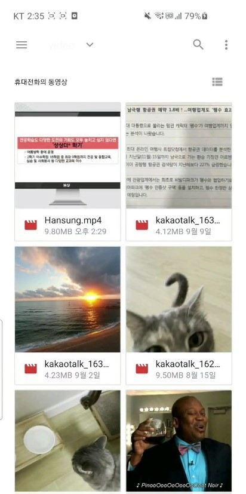
    
- 단어 검색 화면
    
    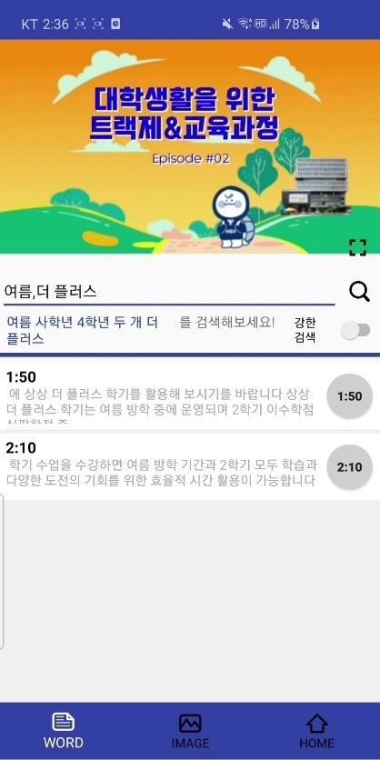 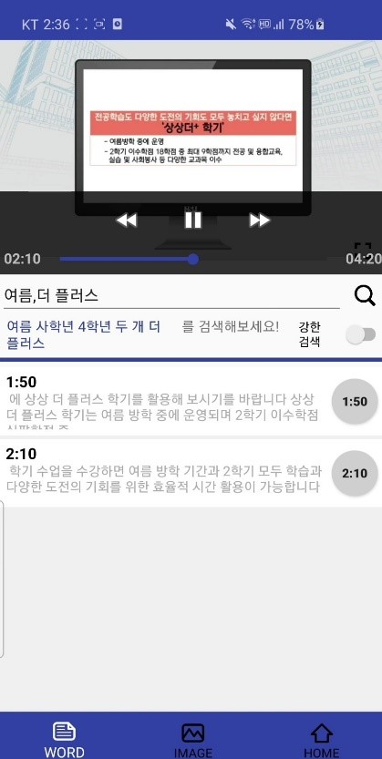
    
- 장면 추출 화면
    
    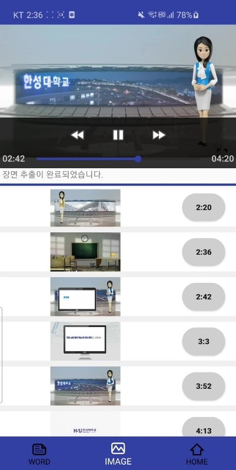 
